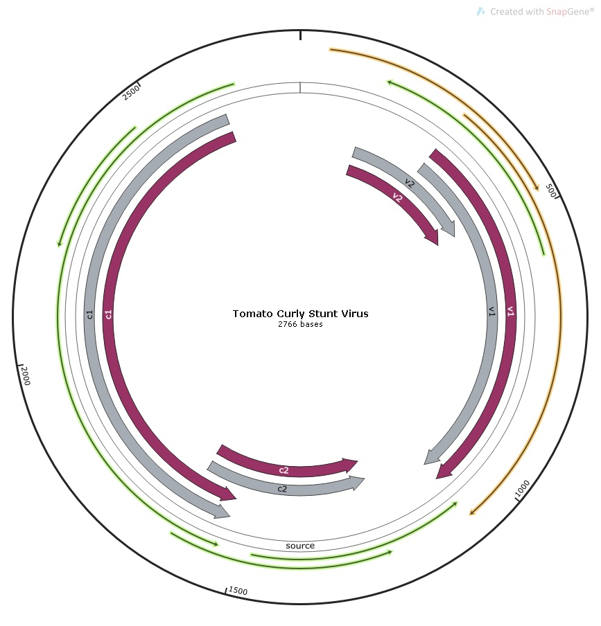
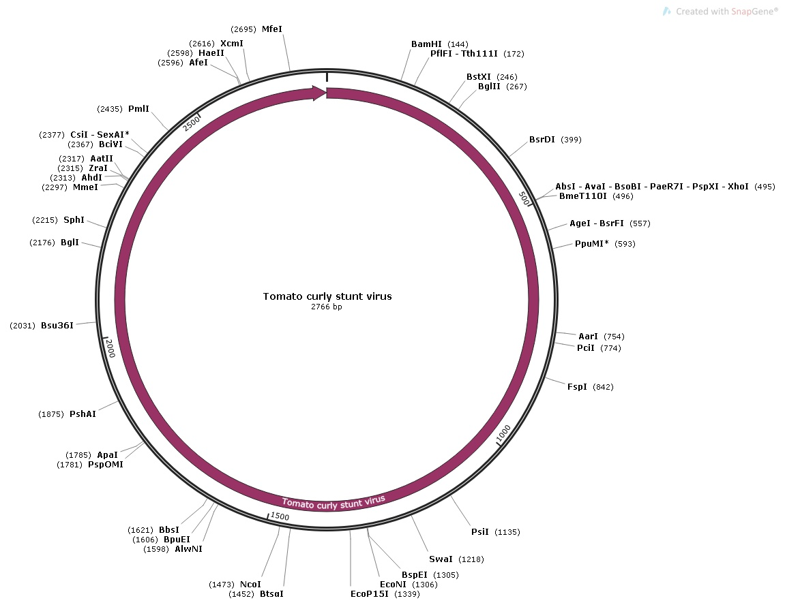

# ACM Research Coding Challenge (Spring 2021)

## No Collaboration Policy

**You may not collaborate with anyone on this challenge.** You _are_ allowed to use Internet documentation. If you _do_ use existing code (either from Github, Stack Overflow, or other sources), **please cite your sources in the README**.

## Submission Procedure

Please follow the below instructions on how to submit your answers.

1. Create a **public** fork of this repo and name it `ACM-Research-Coding-Challenge-S21`. To fork this repo, click the button on the top right and click the "Fork" button.
2. Clone the fork of the repo to your computer using `git clone [the URL of your clone]`. You may need to install Git for this (Google it).
3. Complete the Challenge based on the instructions below.
4. Submit your solution by filling out this [form](https://acmutd.typeform.com/to/uqAJNXUe).

## Question One

Genome analysis is the identification of genomic features such as gene expression or DNA sequences in an individual's genetic makeup. A genbank file (.gb) format contains information about an individual's DNA sequence. The following dataset in `Genome.gb` contains a complete genome sequence of Tomato Curly Stunt Virus. 

**With this file, create a circular genome map and output it as a JPG/PNG/JPEG format.** We're not looking for any complex maps, just be sure to highlight the features and their labels.

**You may use any programming language you feel most comfortable. We recommend Python because it is the easiest to implement. You're allowed to use any library you want to implement this**, just document which ones you used in this README file. Try to complete this as soon as possible.

Regardless if you can or cannot answer the question, provide a short explanation of how you got your solution or how you think it can be solved in your README.md file. However, we highly recommend giving the challenge a try, you just might learn something new!

## Installing Libraries and Helpful Software
Libraries used: biopython - https://biopython.org/
Mapping software: SnapGene Viewer - https://www.snapgene.com/snapgene-viewer/

How to Install biopython:
Step 1: If you do not have python already, please install the latest version of python or you can get anaconda which has Jupyter Notebook

Step 2: In your command line type in “pip install biopython” to install the biopython library

Step 3: If you have Jupyter Notebooks open “circular genome parsing.ipynb”; if you want to use the actual python file then it is labeled “parsed-up-tomato.py”

Step 4: Install Genome.gb file and within the python code, copy and paste the directory including Genome.gb on line 3, right after “SeqIO.parse(’’ between the ‘’’ ‘’’ to replace my directory  for seq_record in SeqIO.parse('''C:/Users/salma/Desktop/ACM-Research-Coding-Challenge-S21/Genome.gb''', "genbank"): 

Step 4: Copy the DNA sequence block of text

## Answer 
In my genomic analysis, I produced images visualizing the circular genomic map of the Tomato Curly Stunt Virus using the organism’s DNA sequence. The first step I took for my solution was to research different technologies that can create a circular genomic map on google. I initially came across biopython which is a library in Python that deals with bioinformatics. I installed biopython and from there parsed and outputted the provided GenBank file. Parsing this file aided in understanding what was contained in the file and how to move on with mapping the contents as it displayed the source, features, organisms, and DNA sequence. The next step I took was looking for how to visualize a circular genome map. I realized that there is better software with better capabilities/tools than Python for this task. The way I found a software was by searching up apps that open GenBank files and came across a list on file.org. I went through the list and looked for any websites that provided genomic mapping tools. I came across a genomic editing and mapping app called Snap Gene Viewer. I installed this on my device and opened the provided GenBank file within Snap Gene Viewer. From here the DNA sequence was simply laid out. I went to the features tab and enabled it to show all features including the proteins and genes such as C & V proteins. Snap Gene displayed the base locations of the proteins and different genes in this Tomato Virus strand in a circular fashion. This is displayed in the file “genome_gene_protein_map.jpg”. I noticed Snap Gene could also display a circular genomic map if provided the DNA sequence. I then went back to my previous Python code and copied the outputted DNA sequence. I opened Snap Gene, clicked open "New File", and pasted in the sequence that Python parsed. This displayed the sequences in a linear and circular fashion. I then clicked on the tab called "Features" to enable the "CDS" feature. From here it displayed all the restriction enzymes in the Tomato Virus sequence, which is shown in the “genome_restriction_enzymes.jpg” file. I went to “File” and exported the circular genome map as a .jpg file. The jpg files display my circular genome map with the different proteins, genes, restriction enzymes, and the base locations in the ssDNA sequence. All in all, a simple and detailed circular genomic map was created by opening the Genbank file in Snap Gene and by also pasting the sequence within. This allowed for a more streamlined and simple visualizatin of the Tomato Curly Stunt Virus genome. 

Potential Python Solution: This can also be displayed in Python by using the reportlab library. From here you would loop through the file contents to look for features, set colors, and then use provided functions to draw the output and output it to a .pdf file. This file would contain a much less detailed and lower quality circular genome. Personally, I believe software that have a focal point on bioinformatics would be best for mapping this circular genome rather than using a python library since Snap Gene is much more visually pleasing, practical in editing gene sequences, and in researching about what your provided sequence contains. 

